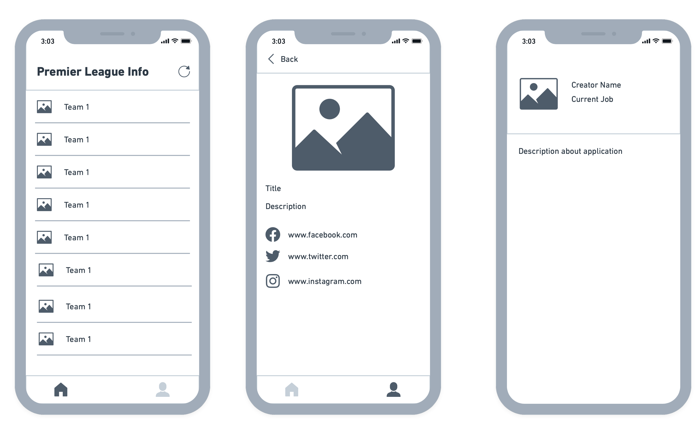

# premier-league-info

Aplikasi PremierLeagueInfo merupakan aplikasi daftar club atau team yang ada di Premier League. Aplikasi ini di rancang khusus untuk keperluan submission akhir pada modul Belajar Aplikasi IOS untuk pemula. Dalam membangun aplikasi ini terdapat beberapa halaman diantaranya adalah sebagai berikut:

| No | Name                         | Fungsi                                                    |
| -- | -----------------------------| --------------------------------------------------------- |
| 1  | Home                         | berfungsi untuk menampilkan list club pada premier league |
| 2  | Detail                       | menampilkan detail informasi dari club yang di pilih      |
| 3  | Profile                      | menjelaskan tentang aplikasi dan profile pembuat          |

berikut merupakan sketsa atau wireframe dari aplikasi PremierLeagueInfo:

### Penjelasan Singkat
1. ketika user pertama kali masuk ke halaman utama atau home maka akan muncul loading yg mana proses ini membutuhkan waktu untuk mengambil data ke API https://www.thesportsdb.com/api.php
2. apabila berhasil maka daftar team atau club akan muncul di halaman home tersebut
3. ketika user memilih salah satu club dari list maka akan di lanjutkan ke halaman detail team yang mana di halaman ini menampilkan deskripsi, gambar serta link sosial media yg dari club tersebut
4. user dapat membuka sosial media dari link yang sudah di tampilkan. apabila data yg di sediakan dari api tersebut kosong atau nil maka link social media tersebut tidak akan di munculkan
5. user dapat kembali ke halaman utama dengan menekan tombol navigasi back di pojok kanan atas
6. tekan "icon person" maka user dapat melihat deskripsi dan pembuat dari aplikasi Permier League Info ini
